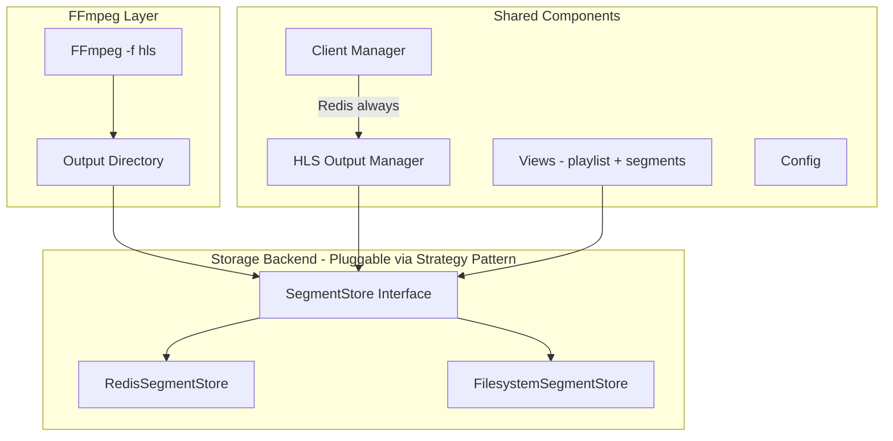

# HLS Output: Dual Backend Storage Design

## Overview

The HLS output system uses a **pluggable storage backend** with a Strategy pattern. This allows:

1. **Redis backend** (default) — Segments stored in Redis, clients served from Redis
2. **Filesystem backend** — Segments written to disk/RAM disk, clients served from filesystem

Both backends share the same FFmpeg management, client tracking, playlist generation, and view layer. Only the storage/retrieval mechanism changes.

---

## Architecture



### Storage Backend Interface

```python
from abc import ABC, abstractmethod
from typing import Optional


class SegmentStore(ABC):
    """Abstract base class for HLS segment storage backends."""

    @abstractmethod
    def store_playlist(self, channel_uuid: str, content: str) -> bool:
        """Store the m3u8 playlist content."""
        ...

    @abstractmethod
    def get_playlist(self, channel_uuid: str) -> Optional[str]:
        """Retrieve the m3u8 playlist content."""
        ...

    @abstractmethod
    def store_segment(self, channel_uuid: str, segment_name: str, data: bytes) -> bool:
        """Store a segment file (e.g., index0.ts, init.mp4)."""
        ...

    @abstractmethod
    def get_segment(self, channel_uuid: str, segment_name: str) -> Optional[bytes]:
        """Retrieve a segment file."""
        ...

    @abstractmethod
    def has_segment(self, channel_uuid: str, segment_name: str) -> bool:
        """Check if a segment exists."""
        ...

    @abstractmethod
    def cleanup_channel(self, channel_uuid: str):
        """Remove all data for a channel."""
        ...

    @abstractmethod
    def get_segment_count(self, channel_uuid: str) -> int:
        """Get number of stored segments for a channel."""
        ...
```

---

## Backend 1: Redis Storage

```python
class RedisSegmentStore(SegmentStore):
    """Store HLS segments in Redis with TTL-based auto-expiry."""

    KEY_PREFIX = "hls_output"

    def __init__(self, redis_client, segment_ttl=120):
        self.redis = redis_client
        self.segment_ttl = segment_ttl  # Seconds before segment auto-expires

    def _playlist_key(self, channel_uuid):
        return f"{self.KEY_PREFIX}:{channel_uuid}:playlist"

    def _segment_key(self, channel_uuid, segment_name):
        # Normalize: index0.ts -> seg:0, init.mp4 -> init
        return f"{self.KEY_PREFIX}:{channel_uuid}:seg:{segment_name}"

    def store_playlist(self, channel_uuid, content):
        key = self._playlist_key(channel_uuid)
        self.redis.setex(key, self.segment_ttl, content)
        return True

    def get_playlist(self, channel_uuid):
        key = self._playlist_key(channel_uuid)
        data = self.redis.get(key)
        return data.decode("utf-8") if data else None

    def store_segment(self, channel_uuid, segment_name, data):
        key = self._segment_key(channel_uuid, segment_name)
        self.redis.setex(key, self.segment_ttl, data)
        return True

    def get_segment(self, channel_uuid, segment_name):
        key = self._segment_key(channel_uuid, segment_name)
        return self.redis.get(key)  # Returns bytes or None

    def has_segment(self, channel_uuid, segment_name):
        key = self._segment_key(channel_uuid, segment_name)
        return self.redis.exists(key)

    def cleanup_channel(self, channel_uuid):
        # Delete all keys matching this channel
        pattern = f"{self.KEY_PREFIX}:{channel_uuid}:*"
        keys = self.redis.keys(pattern)
        if keys:
            self.redis.delete(*keys)

    def get_segment_count(self, channel_uuid):
        pattern = f"{self.KEY_PREFIX}:{channel_uuid}:seg:*"
        return len(self.redis.keys(pattern))
```

**How FFmpeg writes to Redis:**

FFmpeg always writes to a **temporary internal directory** (`/tmp/dispatcharr_hls/{uuid}/`). A watcher thread reads new files and pushes to Redis:

```python
class RedisHLSWatcher:
    """Watches FFmpeg output dir and pushes segments to Redis."""

    def __init__(self, channel_uuid, ffmpeg_output_dir, store: RedisSegmentStore):
        self.channel_uuid = channel_uuid
        self.output_dir = ffmpeg_output_dir
        self.store = store
        self._known_files = {}  # filename -> mtime
        self._running = False

    def watch_loop(self):
        while self._running:
            try:
                for filename in os.listdir(self.output_dir):
                    filepath = os.path.join(self.output_dir, filename)
                    mtime = os.path.getmtime(filepath)

                    if filename not in self._known_files or mtime > self._known_files[filename]:
                        if filename.endswith(".m3u8"):
                            with open(filepath, "r") as f:
                                self.store.store_playlist(self.channel_uuid, f.read())
                        elif filename.endswith((".ts", ".m4s", ".mp4")):
                            with open(filepath, "rb") as f:
                                self.store.store_segment(self.channel_uuid, filename, f.read())
                        self._known_files[filename] = mtime

            except Exception as e:
                logger.error(f"Watcher error: {e}")

            time.sleep(0.1)  # 100ms poll interval for responsiveness
```

**Cleanup:** When the session stops, both the Redis keys (via `cleanup_channel()`) and the temp dir (via `shutil.rmtree`) are removed.

---

## Backend 2: Filesystem Storage (RAM Disk Compatible)

```python
class FilesystemSegmentStore(SegmentStore):
    """Store and serve HLS segments directly from the filesystem.

    This backend is ideal for:
    - RAM disk setups (/dev/shm, tmpfs, Unraid RAM disks)
    - NAS/NFS shared storage
    - High-throughput scenarios where Redis memory is limited

    When using a RAM disk:
    - /dev/shm (Linux shared memory, typically 50% of RAM)
    - Docker tmpfs mounts
    - Custom RAM disks created by the user
    - Unraid's /dev/shm or /tmp/xxx
    """

    def __init__(self, base_path="/data/hls"):
        self.base_path = base_path
        os.makedirs(base_path, exist_ok=True)

    def _channel_dir(self, channel_uuid):
        path = os.path.join(self.base_path, channel_uuid)
        os.makedirs(path, exist_ok=True)
        return path

    def store_playlist(self, channel_uuid, content):
        filepath = os.path.join(self._channel_dir(channel_uuid), "index.m3u8")
        with open(filepath, "w") as f:
            f.write(content)
        return True

    def get_playlist(self, channel_uuid):
        filepath = os.path.join(self._channel_dir(channel_uuid), "index.m3u8")
        if os.path.exists(filepath):
            with open(filepath, "r") as f:
                return f.read()
        return None

    def store_segment(self, channel_uuid, segment_name, data):
        filepath = os.path.join(self._channel_dir(channel_uuid), segment_name)
        with open(filepath, "wb") as f:
            f.write(data)
        return True

    def get_segment(self, channel_uuid, segment_name):
        filepath = os.path.join(self._channel_dir(channel_uuid), segment_name)
        if os.path.exists(filepath):
            with open(filepath, "rb") as f:
                return f.read()
        return None

    def has_segment(self, channel_uuid, segment_name):
        filepath = os.path.join(self._channel_dir(channel_uuid), segment_name)
        return os.path.exists(filepath)

    def cleanup_channel(self, channel_uuid):
        channel_dir = os.path.join(self.base_path, channel_uuid)
        if os.path.exists(channel_dir):
            shutil.rmtree(channel_dir)

    def get_segment_count(self, channel_uuid):
        channel_dir = os.path.join(self.base_path, channel_uuid)
        if not os.path.exists(channel_dir):
            return 0
        return len([f for f in os.listdir(channel_dir) if f.endswith((".ts", ".m4s"))])
```

**How FFmpeg writes in filesystem mode:**

FFmpeg writes **directly** to the serving directory — no watcher needed! This is the simplest possible setup:

```python
# FFmpeg writes directly to the storage path
ffmpeg_cmd = [
    "ffmpeg", "-i", stream_url,
    "-f", "hls",
    "-hls_time", str(segment_duration),
    "-hls_list_size", str(playlist_size),
    os.path.join(store.base_path, channel_uuid, "index.m3u8")
]
```

**RAM Disk Support:** The filesystem backend naturally supports any path, including:

| Path                 | Type                     | Speed           | Persistence         |
| -------------------- | ------------------------ | --------------- | ------------------- |
| `/dev/shm`           | Linux shared memory      | Fastest         | Lost on reboot      |
| Docker `tmpfs` mount | Container RAM disk       | Fastest         | Lost on restart     |
| `/mnt/user/ramdisk`  | Custom RAM disk (Unraid) | Fastest         | Lost on reboot      |
| `/data/hls`          | Regular disk             | Depends on disk | Persists            |
| NFS mount            | Network storage          | Varies          | Shared across nodes |

---

## Backend Selection and Configuration

### Settings Model (via CoreSettings)

```python
HLS_OUTPUT_SETTINGS_KEY = "hls_output_settings"

# Default settings
{
    # Storage backend: "redis" or "filesystem"
    "storage_backend": "redis",

    # Filesystem backend settings (used when storage_backend="filesystem")
    "output_path": "/dev/shm",  # Default to RAM disk

    # FFmpeg settings (shared by both backends)
    "segment_duration": 6,
    "playlist_size": 10,
    "shutdown_delay": 30,
    "ll_hls_enabled": False,
    "use_fmp4_segments": False,

    # Redis backend settings
    "redis_segment_ttl": 120,  # Seconds before segments auto-expire in Redis
}
```

### Factory Function

```python
def create_segment_store(settings: dict) -> SegmentStore:
    """Create the appropriate segment store based on settings."""
    backend = settings.get("storage_backend", "redis")

    if backend == "redis":
        redis_client = get_redis_client()
        ttl = settings.get("redis_segment_ttl", 120)
        return RedisSegmentStore(redis_client, segment_ttl=ttl)
    elif backend == "filesystem":
        path = settings.get("output_path", "/dev/shm")
        return FilesystemSegmentStore(base_path=path)
    else:
        raise ValueError(f"Unknown HLS storage backend: {backend}")
```

---

## FFmpeg Output Management

The HLS Output Manager handles FFmpeg regardless of the backend:

```python
class HLSOutputManager:
    """Manages HLS output sessions with pluggable storage."""

    def start_session(self, channel_uuid, stream_url, user_agent):
        settings = CoreSettings.get_hls_output_settings()
        store = create_segment_store(settings)

        if isinstance(store, RedisSegmentStore):
            # Redis mode: FFmpeg writes to temp dir, watcher pushes to Redis
            temp_dir = f"/tmp/dispatcharr_hls/{channel_uuid}"
            os.makedirs(temp_dir, exist_ok=True)

            ffmpeg_output = os.path.join(temp_dir, "index.m3u8")
            cmd = self._build_ffmpeg_command(stream_url, user_agent, ffmpeg_output, settings)

            # Start FFmpeg
            process = subprocess.Popen(cmd, ...)

            # Start watcher to push segments to Redis
            watcher = RedisHLSWatcher(channel_uuid, temp_dir, store)
            watcher.start()

        elif isinstance(store, FilesystemSegmentStore):
            # Filesystem mode: FFmpeg writes directly to serving path
            channel_dir = store._channel_dir(channel_uuid)
            ffmpeg_output = os.path.join(channel_dir, "index.m3u8")
            cmd = self._build_ffmpeg_command(stream_url, user_agent, ffmpeg_output, settings)

            # Start FFmpeg - no watcher needed
            process = subprocess.Popen(cmd, ...)

        # Create session object
        session = HLSSession(
            channel_uuid=channel_uuid,
            process=process,
            store=store,
            watcher=watcher if isinstance(store, RedisSegmentStore) else None,
            temp_dir=temp_dir if isinstance(store, RedisSegmentStore) else None,
        )
        return session
```

---

## Unified View Layer

The views work identically regardless of backend:

```python
def hls_segment(request, channel_uuid, segment_name):
    """Serve an HLS segment from the configured storage backend."""
    store = get_active_store(channel_uuid)

    data = store.get_segment(channel_uuid, segment_name)
    if not data:
        return HttpResponseNotFound("Segment not found")

    content_type = "video/mp2t" if segment_name.endswith(".ts") else "video/mp4"
    return HttpResponse(data, content_type=content_type)
```

---

## Upstream PR Strategy with Dual Backend

For the upstream PR, present it this way:

1. **Default: Redis backend** — aligns with SergeantPanda's stated vision
2. **Optional: Filesystem backend** — for power users on RAM disk/NAS setups
3. **Configuration via Settings UI** — simple dropdown: Redis / Filesystem
4. **Both backends share:** FFmpeg management, client tracking, views, URL routing

The maintainer gets the Redis approach they want, while users who need filesystem/RAM disk have the option. This is a win-win.

### What Gets Submitted to Upstream

**Phase 1 PR: Backend + Redis storage (default)**

- `apps/proxy/hls_output/` module
- Redis segment store (default)
- Core settings integration
- 1 migration
- Tests

**Phase 2 PR: Filesystem backend + Settings UI**

- Filesystem segment store
- RAM disk documentation
- Settings UI for backend selection
- Frontend HLS toggle
- HDHR-HLS endpoints

---

## RAM Disk Recommendations for Users

### Unraid

```yaml
# In docker-compose.yml or Unraid template
# Option 1: Use Unraid's shared memory
HLS_OUTPUT_PATH=/dev/shm

# Option 2: Create a custom RAM disk
# In Unraid terminal: mkdir -p /tmp/ramdisk && mount -t tmpfs -o size=2G tmpfs /tmp/ramdisk
HLS_OUTPUT_PATH=/tmp/ramdisk
```

### Docker (any platform)

```yaml
# In docker-compose.yml
services:
  dispatcharr:
    tmpfs:
      - /data/hls:size=2G,mode=1777
    environment:
      - HLS_STORAGE_BACKEND=filesystem
      - HLS_OUTPUT_PATH=/data/hls
```

### LXC Containers

```bash
# Mount tmpfs inside LXC
mount -t tmpfs -o size=2G,mode=1777 tmpfs /data/hls
```

### Standard Linux

```bash
# /dev/shm is always available (typically 50% of RAM)
# Or create a custom mount:
sudo mount -t tmpfs -o size=2G tmpfs /mnt/hls-ramdisk
```

---

## Summary

| Feature            | Redis Backend             | Filesystem Backend            |
| ------------------ | ------------------------- | ----------------------------- |
| Default            | Yes                       | No (opt-in)                   |
| Memory usage       | Redis RAM                 | Disk/RAM disk                 |
| Multi-worker       | Full support              | Shared mount needed           |
| Configuration      | Zero                      | Path setting required         |
| Segment cleanup    | Auto (TTL)                | Manual or on-stop             |
| RAM disk support   | N/A (Redis is in-memory)  | Yes - /dev/shm, tmpfs, custom |
| Docker config      | None                      | Volume or tmpfs mount         |
| Performance        | Fast (Redis)              | Fastest (direct file)         |
| Upstream alignment | Matches maintainer vision | Power user option             |
