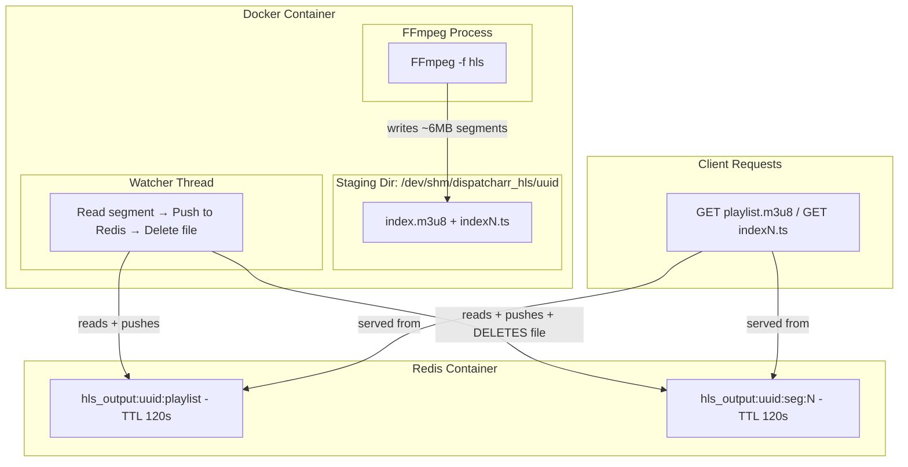

# HLS Redis Backend: RAM Disk Staging Directory Design

## The Problem

When using the Redis storage backend, FFmpeg needs a **staging directory** to write HLS segments before the watcher thread pushes them to Redis. If this staging directory uses the Docker container's **internal writable layer** (`/tmp` on overlay2):

1. **Docker's writable layer is small** — default overlay2 has limited space
2. **Filling it crashes the container** — impacts all Docker processes, not just HLS
3. **overlay2 writes are slow** — not designed for high-throughput IO
4. **Not configurable** — users cannot resize the container's writable layer easily

### How much staging space is actually needed?

The staging directory is **transient** — files only exist for ~100-200ms between FFmpeg writing them and the watcher pushing to Redis then deleting them. However, at any given moment:

- **Per channel:** Latest segment being written + previous segment waiting for watcher = ~12MB (2 × 6MB at 8Mbps)
- **5 channels:** ~60MB
- **20 channels:** ~240MB
- **Safety margin (2x):** ~480MB for 20 channels

This is very manageable for a RAM disk but problematic for a tiny container writable layer.

---

## Solution: Three-Tier Storage Configuration

The Redis backend's staging directory must be on fast, configurable storage. Here's the design:

### Storage Tiers for Redis Backend

```
Tier 1: FFmpeg Staging Dir (transient ~100ms per file)
  ├── Default: /dev/shm/dispatcharr_hls/
  ├── Alt: Docker tmpfs mount
  └── Alt: User RAM disk volume mount

Tier 2: Redis (segments stored with TTL)
  └── Redis server memory (already managed by Redis config)

Tier 3: Client Serving
  └── HTTP views read from Redis (Tier 2)
```

### Default: `/dev/shm` (Shared Memory)

`/dev/shm` is a **tmpfs-backed shared memory** filesystem that is:

- **Always available** in Linux containers — it's a POSIX standard
- **RAM-backed** — fastest possible IO
- **Docker-configurable** via `shm_size` in docker-compose or `--shm-size` CLI flag
- **Default 64MB** in Docker — enough for 2-3 simultaneous channels
- **Easily expandable** — users just change one docker-compose line

```yaml
# docker-compose.yml - Increase shared memory for HLS
services:
  dispatcharr:
    shm_size: "2gb" # Increase from default 64MB
```

The HLS output module automatically uses `/dev/shm/dispatcharr_hls/` and creates per-channel subdirectories. The watcher reads each segment, pushes to Redis, and **deletes the file** immediately — keeping the staging directory lean.

### Alternative: Configurable Staging Path via Environment Variable

For users who want to use a different RAM disk:

```yaml
environment:
  # Point FFmpeg staging to a custom RAM disk
  - HLS_STAGING_PATH=/mnt/ramdisk/hls
```

Or in the Settings UI:

- **HLS Staging Path** — Path where FFmpeg temporarily writes segments before pushing to Redis. Must be fast storage (RAM disk recommended). Default: `/dev/shm/dispatcharr_hls/`

### Alternative: Docker tmpfs Mount

Users can also use Docker's native tmpfs:

```yaml
services:
  dispatcharr:
    tmpfs:
      - /tmp/hls:size=2G,mode=1777
    environment:
      - HLS_STAGING_PATH=/tmp/hls
```

### Alternative: Host RAM Disk Volume Mount (Unraid, LXC, etc.)

```yaml
services:
  dispatcharr:
    volumes:
      - /dev/shm/dispatcharr_hls:/staging/hls:rw
    environment:
      - HLS_STAGING_PATH=/staging/hls
```

For Unraid specifically:

```yaml
volumes:
  - /tmp/user.ramdisk/dispatcharr_hls:/staging/hls:rw
```

---

## Implementation Design

### Configuration Model

```python
HLS_OUTPUT_SETTINGS = {
    # Storage backend: "redis" or "filesystem"
    "storage_backend": "redis",

    # FFmpeg staging path for Redis backend
    # Default: /dev/shm/dispatcharr_hls/
    # Override via HLS_STAGING_PATH env var
    "staging_path": "/dev/shm/dispatcharr_hls",

    # Filesystem backend output path (only used when storage_backend="filesystem")
    "output_path": "/data/hls",

    # Shared FFmpeg settings
    "segment_duration": 6,
    "playlist_size": 10,
    "shutdown_delay": 30,
    "ll_hls_enabled": False,
    "use_fmp4_segments": False,

    # Redis backend settings
    "redis_segment_ttl": 120,
}
```

### Staging Path Resolution

```python
import os

def get_staging_path() -> str:
    """Resolve the FFmpeg staging directory for Redis mode.

    Priority:
    1. HLS_STAGING_PATH environment variable
    2. Settings UI value
    3. Default: /dev/shm/dispatcharr_hls/

    Validates the path is writable and has sufficient space.
    """
    # Check env var first (takes priority for Docker config)
    path = os.environ.get("HLS_STAGING_PATH")

    if not path:
        # Check settings
        settings = CoreSettings.get_hls_output_settings()
        path = settings.get("staging_path", "/dev/shm/dispatcharr_hls")

    # Ensure directory exists
    os.makedirs(path, exist_ok=True)

    # Validate writable
    test_file = os.path.join(path, ".hls_staging_test")
    try:
        with open(test_file, "w") as f:
            f.write("test")
        os.remove(test_file)
    except (IOError, OSError) as e:
        logger.error(
            f"HLS staging path {path} is not writable: {e}. "
            f"Falling back to /tmp/dispatcharr_hls/"
        )
        path = "/tmp/dispatcharr_hls"
        os.makedirs(path, exist_ok=True)

    return path


def check_staging_space(path: str, min_mb: int = 100) -> bool:
    """Check if the staging path has sufficient free space."""
    try:
        stat = os.statvfs(path)
        free_mb = (stat.f_bavail * stat.f_frsize) / (1024 * 1024)
        if free_mb < min_mb:
            logger.warning(
                f"HLS staging path {path} has only {free_mb:.0f}MB free "
                f"(minimum recommended: {min_mb}MB). "
                f"Consider increasing shm_size in docker-compose.yml or "
                f"using a larger RAM disk."
            )
            return False
        return True
    except Exception as e:
        logger.warning(f"Could not check staging space: {e}")
        return True  # Don't block startup on check failure
```

### Watcher with Immediate Deletion

```python
class RedisHLSWatcher:
    """Watches FFmpeg staging dir and pushes segments to Redis.

    Files are deleted immediately after being pushed to Redis
    to keep staging directory usage minimal.
    """

    def __init__(self, channel_uuid, staging_dir, redis_store, keep_files=False):
        self.channel_uuid = channel_uuid
        self.staging_dir = staging_dir
        self.store = redis_store
        self.keep_files = keep_files  # For debugging
        self._known_segments = {}  # filename -> mtime
        self._last_playlist_mtime = 0
        self._running = False

    def watch_loop(self):
        while self._running:
            try:
                for filename in os.listdir(self.staging_dir):
                    filepath = os.path.join(self.staging_dir, filename)

                    try:
                        mtime = os.path.getmtime(filepath)
                    except FileNotFoundError:
                        continue  # FFmpeg may delete old segments

                    # Skip if already processed at this mtime
                    if filename in self._known_segments and mtime <= self._known_segments[filename]:
                        continue

                    if filename.endswith(".m3u8"):
                        # Playlist file - read and push to Redis
                        try:
                            with open(filepath, "r") as f:
                                content = f.read()
                            self.store.store_playlist(self.channel_uuid, content)
                            self._known_segments[filename] = mtime
                        except Exception as e:
                            logger.error(f"Error reading playlist: {e}")

                    elif filename.endswith((".ts", ".m4s")):
                        # Segment file - read, push to Redis, DELETE from staging
                        try:
                            # Brief wait to ensure FFmpeg finished writing
                            time.sleep(0.02)
                            with open(filepath, "rb") as f:
                                data = f.read()

                            self.store.store_segment(self.channel_uuid, filename, data)
                            self._known_segments[filename] = mtime

                            # DELETE from staging to free space immediately
                            if not self.keep_files:
                                try:
                                    os.remove(filepath)
                                except OSError:
                                    pass  # May already be deleted by FFmpeg

                        except Exception as e:
                            logger.error(f"Error processing segment {filename}: {e}")

                    elif filename == "init.mp4":
                        # fMP4 init segment
                        try:
                            with open(filepath, "rb") as f:
                                data = f.read()
                            self.store.store_segment(self.channel_uuid, filename, data)
                            self._known_segments[filename] = mtime
                        except Exception as e:
                            logger.error(f"Error processing init segment: {e}")

            except Exception as e:
                logger.error(f"Watcher error for {self.channel_uuid}: {e}")

            time.sleep(0.1)  # 100ms poll
```

**Note the key line:** `os.remove(filepath)` — segments are **deleted from the staging directory** immediately after being pushed to Redis. This means the staging directory only ever contains:

- The playlist file (tiny, ~1KB)
- The segment currently being written by FFmpeg
- Zero or one segment waiting for the watcher (100ms latency)

**Actual staging usage per channel: ~6-12MB** (one or two segments at most).

---

## Complete Storage Flow Diagram



---

## Configuration Examples for Different Platforms

### Docker (Default - No Configuration Needed)

```yaml
services:
  dispatcharr:
    # Default: uses /dev/shm with 64MB (supports ~2 channels)
    # For more channels, add shm_size:
    shm_size: "2gb"
```

### Docker (Dedicated tmpfs Volume)

```yaml
services:
  dispatcharr:
    tmpfs:
      - /staging/hls:size=2G,mode=1777
    environment:
      - HLS_STAGING_PATH=/staging/hls
```

### Unraid

```yaml
services:
  dispatcharr:
    volumes:
      # Unraid's tmpfs at /tmp or custom ramdisk
      - /tmp/user.ramdisk/dispatcharr/hls:/staging/hls:rw
    environment:
      - HLS_STAGING_PATH=/staging/hls
```

Or simply use the built-in `/dev/shm`:

```yaml
services:
  dispatcharr:
    shm_size: "2gb" # Increase shared memory
```

### LXC Containers

```bash
# Inside LXC: mount tmpfs for HLS staging
mount -t tmpfs -o size=2G,mode=1777 tmpfs /staging/hls

# Set environment variable
export HLS_STAGING_PATH=/staging/hls
```

### Bare Metal / VM

```bash
# Create a dedicated tmpfs mount
sudo mkdir -p /mnt/hls-staging
sudo mount -t tmpfs -o size=2G,mode=1777 tmpfs /mnt/hls-staging

# Set in environment
export HLS_STAGING_PATH=/mnt/hls-staging
```

---

## Memory and Space Summary

### Redis Mode with Staging Directory

| Component                      | Space Used                   | Duration                      |
| ------------------------------ | ---------------------------- | ----------------------------- |
| Staging dir (FFmpeg → watcher) | ~6-12MB per channel          | Transient (~100ms per file)   |
| Redis (serving cache)          | ~60MB per channel (10 × 6MB) | TTL-controlled (120s default) |
| **Total per channel**          | **~72MB**                    |                               |
| **20 channels**                | **~1.44GB**                  |                               |

### Filesystem Mode (Direct Serve from RAM Disk)

| Component                         | Space Used        | Duration            |
| --------------------------------- | ----------------- | ------------------- |
| RAM disk (FFmpeg writes + serves) | ~60MB per channel | Until session stops |
| **Total per channel**             | **~60MB**         |                     |
| **20 channels**                   | **~1.2GB**        |                     |

### Comparison

| Aspect             | Redis + Staging                 | Direct Filesystem   |
| ------------------ | ------------------------------- | ------------------- |
| Total memory       | Slightly more (Redis + staging) | RAM disk only       |
| Multi-worker       | Yes (Redis shared)              | Needs shared mount  |
| Cleanup            | Automatic (TTL)                 | Manual on stop      |
| Config complexity  | `shm_size` or env var           | Volume mount + path |
| Upstream alignment | Matches maintainer vision       | Power user option   |

---

## Recommended Default Docker Compose for HLS

```yaml
services:
  dispatcharr:
    image: ghcr.io/dispatcharr/dispatcharr:latest
    shm_size: "2gb" # RAM for HLS staging (Redis mode)
    ports:
      - 9191:9191
    volumes:
      - ./data:/data
    # ... rest of config
```

One line (`shm_size: '2gb'`) enables HLS staging on RAM with 2GB capacity (~30+ simultaneous channels). Zero additional environment variables needed — the module auto-detects `/dev/shm` availability and uses it.
