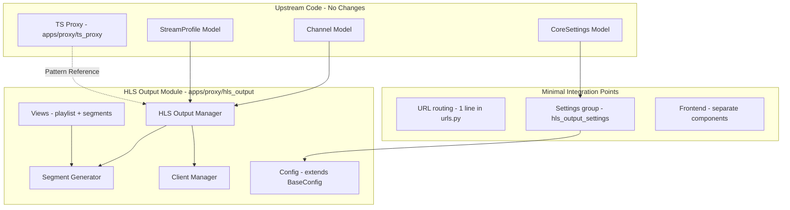

# HLS Output: Upstream-Compatible Implementation Investigation Report

## Executive Summary

After extensive investigation of Dispatcharr's architecture, the upstream maintainer's stated vision, PR history, and coding patterns, this report presents findings on how to implement HLS output streaming in a way that:

1. **Never breaks on upstream sync** — minimal or zero modifications to upstream files
2. **Aligns 100% with Dispatcharr's coding standards and architecture**
3. **Maximizes the chance of upstream acceptance**

The key insight: **SergeantPanda (lead maintainer) explicitly stated in [Issue #1003](https://github.com/Dispatcharr/Dispatcharr/issues/1003) that "output profiles is a planned feature and HLS output would be part of that"** and described using **Redis to store segments** with a **stream generator per client just like TS proxy**. This defines the target architecture.

---

## 1. Critical Findings from Upstream Investigation

### 1.1 Maintainer's Stated Vision (Issue #1003)

> _"So, output profiles is a planned feature and HLS output would be part of that. I'm not sure it would improve scalability very much if at all. It would still use Redis to store the segments and serve them with a stream generator per client just like we do with TS."_
> — SergeantPanda, Feb 23, 2026

This tells us:

- The maintainer envisions HLS as part of a broader **output profiles** system
- Segment storage should use **Redis** (not filesystem)
- Client serving should use a **stream generator per client** (like TS proxy)
- The maintainer does NOT expect HLS to improve scalability

### 1.2 Upstream Architecture Patterns

#### Proxy Module Organization

```
apps/proxy/
  ├── config.py          # Shared config: BaseConfig, HLSConfig, TSConfig
  ├── apps.py            # Initializes HLS + TS proxy servers
  ├── hls_proxy/         # HLS INPUT proxy (consuming HLS sources)
  ├── ts_proxy/          # TS proxy (the main streaming engine)
  │   ├── server.py      # ProxyServer singleton
  │   ├── stream_manager.py
  │   ├── stream_buffer.py
  │   ├── stream_generator.py
  │   ├── client_manager.py
  │   ├── channel_status.py
  │   ├── views.py
  │   └── ...
  └── vod_proxy/         # VOD proxy
```

**Key pattern: Each proxy type is a self-contained sub-module** under `apps/proxy/` with its own server, manager, views, etc.

#### CoreSettings Pattern

The upstream uses a clean grouped JSON settings pattern:

```python
# In core/models.py
PROXY_SETTINGS_KEY = "proxy_settings"

class CoreSettings:
    @classmethod
    def _get_group(cls, key, defaults=None): ...
    @classmethod
    def _update_group(cls, key, name, updates): ...
    @classmethod
    def get_proxy_settings(cls): ...
```

Settings groups: `stream_settings`, `dvr_settings`, `backup_settings`, `proxy_settings`, `network_access`, `system_settings`, `epg_settings`

#### StreamProfile Model

- Simple: `name`, `command`, `parameters`, `locked`, `is_active`, `user_agent`
- **NO `profile_type` field**
- `build_command()` takes only `stream_url` and `user_agent`
- Locked profiles: `Proxy`, `Redirect`, `ffmpeg`, `VLC`, `streamlink`
- Protected from modification via `save()` override

### 1.3 What Your Current Implementation Does Differently (Conflict Points)

| Your Implementation                                    | Upstream Pattern                          | Conflict Level                               |
| ------------------------------------------------------ | ----------------------------------------- | -------------------------------------------- |
| `profile_type` field on StreamProfile                  | No such field exists                      | **HIGH** — schema change on shared model     |
| `build_command()` with `hls_output_path`, `hls_config` | Only `stream_url`, `user_agent`           | **HIGH** — signature change on shared method |
| `HLS_OUTPUT_SETTINGS_KEY` in core/models.py            | Settings use `_get_group()` pattern       | **MEDIUM** — different pattern               |
| HLS Proxy and HLS FFmpeg locked profiles               | Only 5 locked profiles upstream           | **MEDIUM** — new locked profiles             |
| `get_hls_stream_profile()` on Channel model            | No such method upstream                   | **MEDIUM** — adding to shared model          |
| 15 core migrations (0019-0033)                         | Upstream has 0019-0021 for other features | **CRITICAL** — migration conflicts           |
| `apps/output/hls/` directory                           | Upstream has no `hls/` in output          | **LOW** — additive                           |
| Frontend HLS toggle in ~6 components                   | Upstream components have evolved          | **HIGH** — touching shared frontend files    |
| Filesystem-based HLS segment storage                   | Maintainer wants Redis-based              | **HIGH** — architectural mismatch            |

---

## 2. Upstream-Compatible HLS Implementation Approaches

### Approach A: Self-Contained HLS Output Module (Recommended)

Place HLS output as `apps/proxy/hls_output/` — following the exact same pattern as `ts_proxy/`, `hls_proxy/`, and `vod_proxy/`.

#### Architecture



#### Key Design Decisions

1. **Segment Storage: Redis (matching maintainer's vision)**
   - Store HLS segments in Redis with TTL (like TS proxy stores chunks)
   - Generate m3u8 playlists dynamically from Redis segment metadata
   - No filesystem dependency = no Docker volume mount configuration needed
   - Matches SergeantPanda's explicit statement about Redis storage

2. **No `profile_type` on StreamProfile**
   - Instead of adding a field to StreamProfile, the HLS output manager internally manages its own FFmpeg command
   - Use the existing `ffmpeg` locked profile's command as a base, then append HLS-specific output flags
   - OR create a single locked `HLS Output` profile via migration, but without the `profile_type` field — just use the profile name to identify it

3. **Settings via `CoreSettings._get_group()` pattern**

   ```python
   HLS_OUTPUT_SETTINGS_KEY = "hls_output_settings"

   @classmethod
   def get_hls_output_settings(cls):
       return cls._get_group(HLS_OUTPUT_SETTINGS_KEY, {
           "segment_duration": 6,
           "playlist_size": 10,
           "shutdown_delay": 30,
           "ll_hls_enabled": False,
           "use_fmp4_segments": False,
       })
   ```

4. **Config extends BaseConfig**

   ```python
   # In apps/proxy/config.py (or apps/proxy/hls_output/config.py)
   class HLSOutputConfig(BaseConfig):
       # HLS output-specific settings
       DEFAULT_SEGMENT_DURATION = 6
       DEFAULT_PLAYLIST_SIZE = 10
       ...
   ```

5. **Stream Generator per Client (like TS proxy)**
   - Each client requesting `/hls/{uuid}/playlist.m3u8` gets a stream generator
   - The generator reads segment data from Redis
   - FFmpeg writes segments to Redis via a pipe reader thread
   - This matches the TS proxy pattern exactly

6. **Minimal upstream file changes**
   - `apps/proxy/urls.py` — add 1 line to include HLS output URLs
   - `dispatcharr/urls.py` — potentially add HDHR-HLS URL (additive)
   - `core/models.py` — add `HLS_OUTPUT_SETTINGS_KEY` constant + `get_hls_output_settings()` method (follows existing pattern)
   - 1 migration for any new locked profile

#### File Structure

```
apps/proxy/hls_output/
  ├── __init__.py
  ├── config.py          # HLS output config extending BaseConfig
  ├── manager.py         # HLSOutputManager - FFmpeg process management
  ├── segment_store.py   # Redis-based segment storage
  ├── playlist.py        # Dynamic m3u8 playlist generation
  ├── client_manager.py  # Client tracking (mirrors ts_proxy pattern)
  ├── views.py           # HTTP endpoints for playlists + segments
  ├── urls.py            # URL routing
  └── tests.py           # Tests
```

#### Upstream File Changes (Minimal)

| File                        | Change                                         | Lines                                        |
| --------------------------- | ---------------------------------------------- | -------------------------------------------- |
| `apps/proxy/urls.py`        | Add `path("hls_output/", include(...))`        | +1 line                                      |
| `core/models.py`            | Add `HLS_OUTPUT_SETTINGS_KEY` + helper methods | +15 lines (follows existing pattern exactly) |
| `core/migrations/00XX_*.py` | Single migration for HLS output profile        | 1 file                                       |
| `core/api_urls.py`          | Add HLS settings viewset registration          | +1 line                                      |
| `core/api_views.py`         | Add HLS settings viewset                       | +30 lines                                    |
| `core/serializers.py`       | Add HLS settings serializer                    | +20 lines                                    |

**Total upstream changes: ~70 lines across 6 files, following existing patterns exactly.**

### Approach B: Application-Level HLS Output (Current approach, modified)

Keep HLS as `apps/output/hls/` but reduce upstream coupling:

- Remove `profile_type` from StreamProfile
- Remove HLS-specific extensions from `build_command()`
- Move all HLS command building into the HLS module itself
- Use `CoreSettings._get_group()` pattern for settings
- Still use filesystem for segments (diverges from maintainer vision)

**Pros:** Closer to your current code, less rewrite
**Cons:** Still touches `apps/output/` which upstream modifies frequently, filesystem storage diverges from maintainer's Redis vision

### Approach C: Plugin-Based HLS Output

Implement HLS as a Dispatcharr plugin (your PR #646 plugin system):

- Zero upstream file changes
- Lives entirely in `/data/plugins/hls_output/`
- BUT: plugin system PR was never merged upstream
- Plugin system has limitations for deep proxy integration

**Pros:** Zero merge conflicts ever
**Cons:** Plugin system not upstream, limited integration depth

---

## 3. Detailed Comparison of Current vs. Recommended Implementation

### 3.1 Segment Storage: Filesystem vs Redis

| Aspect               | Current (Filesystem)          | Recommended (Redis)                  |
| -------------------- | ----------------------------- | ------------------------------------ |
| Storage              | `/data/hls/{uuid}/index*.ts`  | Redis keys: `hls_out:{uuid}:seg:{n}` |
| Cleanup              | Manual file deletion          | Redis TTL auto-expiry                |
| Docker config        | Requires volume mount / tmpfs | No config needed                     |
| Multi-worker         | Requires shared filesystem    | Redis is already shared              |
| Performance          | Disk I/O or ramdisk           | In-memory (Redis)                    |
| Maintainer alignment | Divergent                     | Matches stated vision                |

**How Redis segment storage would work:**

```
FFmpeg → pipe:stdout → Python reader thread → Redis SETEX per segment
Client  → GET playlist → Python generates m3u8 from Redis metadata
Client  → GET segment  → Redis GET → HTTP response
```

### 3.2 Stream Profile Integration

| Aspect            | Current                                      | Recommended                          |
| ----------------- | -------------------------------------------- | ------------------------------------ |
| Model change      | Added `profile_type` field                   | No model changes                     |
| `build_command()` | Extended signature with HLS params           | Use original signature               |
| Profile detection | `is_hls_profile()`, `is_hls_proxy()`         | Module-internal logic                |
| FFmpeg command    | Built by StreamProfile with HLS placeholders | Built by HLS output manager directly |
| Migrations        | 15 HLS-specific migrations                   | 1 migration for locked profile       |

**Recommended approach:**
The HLS output manager builds its own FFmpeg command internally, using the existing `ffmpeg` profile as a reference for input flags but appending HLS muxer options itself:

```python
# In apps/proxy/hls_output/manager.py
def _build_ffmpeg_command(self, stream_url, user_agent):
    config = HLSOutputConfig.get_hls_output_settings()
    return [
        "ffmpeg",
        "-user_agent", user_agent,
        "-i", stream_url,
        "-c", "copy",
        "-f", "hls",
        "-hls_time", str(config["segment_duration"]),
        "-hls_list_size", str(config["playlist_size"]),
        "-hls_flags", "append_list+omit_endlist",
        "-hls_segment_type", "mpegts",
        "pipe:1",  # Output to stdout, read by Python
    ]
```

### 3.3 Frontend Integration

| Aspect               | Current                              | Recommended                              |
| -------------------- | ------------------------------------ | ---------------------------------------- |
| Files modified       | ~8 existing components               | 2-3 new files + minimal existing changes |
| HLS.js integration   | Direct in FloatingVideo.jsx          | Separate HLSPlayer component             |
| Settings page        | Added accordion to Settings.jsx      | Self-contained HlsSettingsForm.jsx       |
| Stream format toggle | Modified ChannelsTable, StreamsTable | Standalone toggle component              |

---

## 4. Upstream Acceptance Criteria Analysis

Based on studying merged PRs, maintainer comments, and code review patterns:

### What Gets Merged

1. **Self-contained additions** — PRs that add new functionality without changing core models significantly
2. **Following existing patterns** — Using `CoreSettings._get_group()`, `_update_group()`, standard serializer patterns
3. **Minimal migration footprint** — 1-2 migrations maximum
4. **No locked profile modifications** — Locked profiles are protected for a reason
5. **Tests included** — Upstream has test files for most modules
6. **Proper commit messages** — Format: `Enhancement:`, `Bug Fix:`, `Refactor:`, `changelog:`, `test:`

### What Gets Rejected/Ignored

1. **Large PRs touching many files** — PR #210 and #646 (plugin system) were both closed
2. **Schema changes to shared models** — Adding fields to StreamProfile, Channel, etc.
3. **Architecture that diverges from the team's vision** — Filesystem segments vs Redis
4. **Breaking changes to existing functionality**

### Recommended PR Strategy for Upstream Acceptance

1. **Open an issue first** — Describe the HLS output feature, reference #1003
2. **Start small** — PR 1: Just the `apps/proxy/hls_output/` module with Redis segment storage
3. **Match the TS proxy pattern** — The closer it mirrors `ts_proxy/`, the easier to review
4. **Include tests** — Follow `apps/output/tests.py` pattern
5. **Separate frontend into its own PR** — Backend first, frontend second
6. **Single migration** — One clean migration for any needed profile/settings
7. **Document the design** — Show how it mirrors the TS proxy pattern

---

## 5. Recommended Action Plan

### Phase 1: Sync Your Fork with Upstream (Immediate)

1. Create a backup branch of your current work
2. Reset your fork's dev branch to upstream's dev
3. All your HLS work lives only in the backup branch

### Phase 2: Re-implement HLS Output (Clean, Upstream-Compatible)

1. Start from a fresh upstream dev base
2. Create `apps/proxy/hls_output/` following the TS proxy pattern
3. Implement Redis-based segment storage
4. Use `CoreSettings._get_group()` for settings
5. Build FFmpeg commands internally (no StreamProfile changes)
6. Single clean migration
7. Minimal integration points in upstream files

### Phase 3: Frontend Integration

1. Create self-contained HLS components
2. Minimal changes to existing components (additive only)
3. HLS.js player as a separate component

### Phase 4: Submit to Upstream

1. Open a discussion/issue referencing #1003
2. Submit as a focused, well-tested PR
3. Backend and frontend as separate PRs if large

---

## 6. What You Can Reuse from Current Implementation

Despite the architectural differences, much of your current code logic is reusable:

| Component                       | Reusability | Notes                                                                                      |
| ------------------------------- | ----------- | ------------------------------------------------------------------------------------------ |
| `hls/config.py`                 | ~70%        | Adapt to use `CoreSettings._get_group()`                                                   |
| `hls/manager.py`                | ~60%        | Core FFmpeg management logic is solid; change segment output from filesystem to Redis pipe |
| `hls/client_manager.py`         | ~80%        | Redis-based client tracking is already correct pattern                                     |
| `hls/views.py`                  | ~50%        | Change segment serving from file reads to Redis reads                                      |
| `hls/urls.py`                   | ~90%        | URL patterns are mostly the same                                                           |
| `HlsSettingsForm.jsx`           | ~90%        | Nearly identical, just adapt API endpoint                                                  |
| `FloatingVideo.jsx` HLS.js code | ~80%        | The HLS.js integration logic is solid                                                      |
| HDHR-HLS endpoints              | ~90%        | These are clean and additive                                                               |
| HLS FFmpeg flags knowledge      | 100%        | All the enterprise flags, reconnect logic, etc.                                            |

---

## 7. Conclusion

**The recommended approach is Approach A: Self-contained HLS output module at `apps/proxy/hls_output/`** with Redis-based segment storage. This:

- **Eliminates upstream sync issues** — only ~70 lines of changes to upstream files
- **Aligns with the maintainer's explicit vision** for HLS output
- **Follows Dispatcharr's established architecture** patterns exactly
- **Maximizes PR acceptance probability** by being small, self-contained, and pattern-consistent
- **Reuses 60-80% of your existing code logic** with architectural adaptation

The biggest change from your current implementation is moving from filesystem-based to Redis-based segment storage. This is a worthwhile investment because it:

1. Eliminates Docker volume configuration complexity
2. Eliminates multi-worker filesystem coordination issues
3. Matches the exact approach SergeantPanda described
4. Auto-cleanup via Redis TTL instead of manual file deletion
