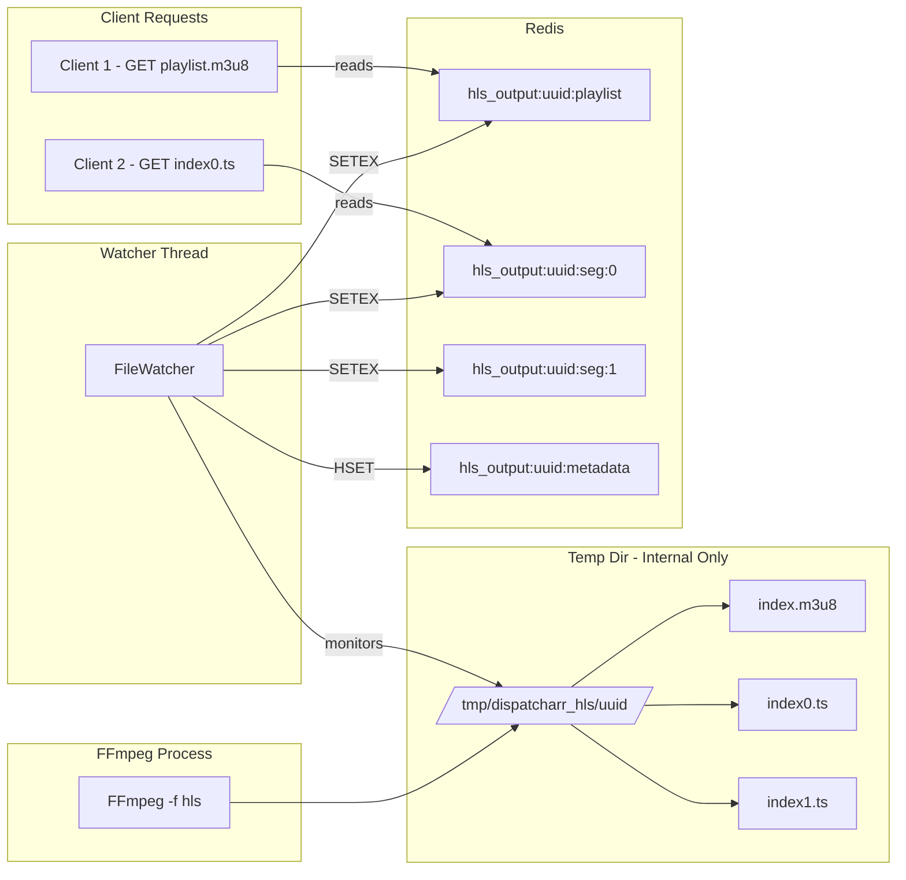

# Redis-Based HLS Segment Storage: Technical Design

## How the TS Proxy Currently Uses Redis

The TS proxy's pattern (from `stream_buffer.py` and `stream_generator.py`):

```
FFmpeg → stdout (MPEG-TS bytes) → Python StreamBuffer.add_chunk() → Redis SETEX per chunk
Client → StreamGenerator.generate() → Redis pipeline GET → yield chunks to HTTP response
```

- **Write side:** `StreamBuffer.add_chunk()` accumulates data from FFmpeg's `pipe:1` stdout, aligns to 188-byte TS packets, and writes ~256KB chunks to Redis with `SETEX` (auto TTL)
- **Read side:** Each client has a `StreamGenerator` that tracks its own `local_index`, reads chunks from Redis using pipeline GETs, and yields them to Django's `StreamingHttpResponse`
- **Key pattern:** `ts_proxy:channel:{uuid}:buffer:chunk:{index}` with configurable TTL

---

## The HLS Challenge: Why It's Different from TS

HLS clients behave fundamentally differently from TS clients:

| TS Proxy Client                        | HLS Client                                             |
| -------------------------------------- | ------------------------------------------------------ |
| Opens a persistent HTTP connection     | Makes multiple HTTP requests                           |
| Receives a continuous byte stream      | Requests playlist.m3u8, then individual .ts segments   |
| Connection stays open until user stops | Polls playlist every few seconds, fetches new segments |
| Server pushes data via generator       | Client pulls segments on demand                        |

Because of this, you cannot simply pipe FFmpeg's output to Redis the same way. HLS requires **discrete segment files** and a **playlist file** that references them.

---

## Technical Approaches for FFmpeg → Redis HLS

### Approach 1: FFmpeg → pipe:1 MPEGTS → Python HLS Segmenter → Redis

```
FFmpeg -f mpegts pipe:1 → Python reads TS packets → Segments by duration → Redis
```

**How it works:**

- FFmpeg outputs MPEG-TS to stdout (same as TS proxy)
- A Python HLS segmenter reads the TS data, accumulates packets, and splits at keyframe boundaries every N seconds
- Each complete segment is stored in Redis
- A playlist is generated dynamically from Redis metadata

**Pros:**

- Pure Redis, no filesystem at all
- Matches TS proxy pattern closely
- No temp files to manage

**Cons:**

- Writing a proper HLS segmenter in Python is complex (must handle keyframe detection, PTS timestamps, segment boundaries)
- Loses FFmpeg's native HLS features: fMP4/CMAF output, LL-HLS part files, `#EXT-X-PROGRAM-DATE-TIME`, proper `#EXT-X-DISCONTINUITY` handling
- Significant engineering effort to get right
- Would need to reimplement what FFmpeg's `hls` muxer already does

**Verdict:** Too complex and loses too many HLS features. Not recommended.

### Approach 2: FFmpeg → Temp Dir → File Watcher → Redis (Recommended)

```
FFmpeg -f hls /tmp/hls/{uuid}/index.m3u8 → inotify/polling watcher → Redis SETEX per segment
Client → GET playlist.m3u8 → Redis → Dynamic response
Client → GET index0.ts → Redis → Segment bytes response
```

**How it works:**

1. FFmpeg uses its native `-f hls` muxer to write segments to a **temporary internal directory** (e.g., `/tmp/dispatcharr_hls/{uuid}/`)
2. A Python watcher thread monitors the directory for new/updated files
3. When a new segment appears, the watcher reads it and stores it in Redis with TTL
4. When the playlist file updates, the watcher stores the updated playlist in Redis
5. HTTP views serve playlists and segments from Redis only
6. The temp directory is cleaned up when the session ends

**Redis Key Structure:**

```
hls_output:{uuid}:playlist      → Current m3u8 playlist content (STRING with TTL)
hls_output:{uuid}:seg:0         → Binary segment data for index0.ts (STRING with TTL)
hls_output:{uuid}:seg:1         → Binary segment data for index1.ts (STRING with TTL)
hls_output:{uuid}:init          → Init segment for fMP4 (STRING with TTL)
hls_output:{uuid}:metadata      → HASH: segment_count, started_at, ffmpeg_pid, etc.
hls_output:{uuid}:clients       → SET of active client IDs
hls_output:{uuid}:client:{id}   → HASH: last_active, segments_served, etc.
```

**Pros:**

- Uses FFmpeg's battle-tested HLS muxer with ALL features: fMP4, LL-HLS, proper discontinuity, EXT-X-PROGRAM-DATE-TIME
- Clients served from Redis (matches maintainer's vision)
- Temp directory is an internal implementation detail — NOT exposed to users
- No Docker volume mount or tmpfs configuration needed
- Works in multi-worker uwsgi environments via Redis
- Auto-cleanup via Redis TTL + temp dir cleanup on stop

**Cons:**

- Brief filesystem IO for the temp dir (mitigated: `/tmp` is usually tmpfs on Linux)
- Small latency between FFmpeg writing and segment appearing in Redis (typically < 100ms)
- Slightly more complex than direct filesystem serving

**Verdict: This is the recommended approach.** It combines FFmpeg's native HLS capabilities with Redis-backed serving.

### Approach 3: FFmpeg → Named Pipe → Redis (Doesn't work for HLS)

FFmpeg's HLS muxer needs to seek within files (to update the playlist, rewrite segment files for fMP4 init segments). Named pipes are sequential-write-only and don't support seeking. This approach is not viable for HLS.

### Approach 4: Hybrid — Serve from filesystem with optional Redis caching

Keep the current filesystem-based approach but add Redis caching as a layer:

- FFmpeg writes to filesystem
- Views check Redis first, fall back to filesystem
- Optional warm-up thread pushes hot segments to Redis

**Verdict:** This doesn't solve the Docker volume mount issue or multi-worker problem, and doesn't align with the maintainer's vision. Not recommended for upstream.

---

## Detailed Design: Approach 2 (Recommended)

### Component Architecture



### Watcher Thread Implementation

```python
class HLSSegmentWatcher:
    """Watches FFmpeg HLS output directory and pushes segments to Redis."""

    def __init__(self, channel_uuid, temp_dir, redis_client, config):
        self.channel_uuid = channel_uuid
        self.temp_dir = temp_dir
        self.redis = redis_client
        self.config = config
        self._known_segments = set()
        self._last_playlist_mtime = 0
        self._running = False

    def start(self):
        """Start watching in a background thread."""
        self._running = True
        self._thread = threading.Thread(target=self._watch_loop, daemon=True)
        self._thread.start()

    def _watch_loop(self):
        """Poll for new/updated files and push to Redis."""
        while self._running:
            try:
                # Check playlist file
                playlist_path = os.path.join(self.temp_dir, "index.m3u8")
                if os.path.exists(playlist_path):
                    mtime = os.path.getmtime(playlist_path)
                    if mtime > self._last_playlist_mtime:
                        with open(playlist_path, "r") as f:
                            playlist_content = f.read()
                        # Store in Redis with TTL
                        key = f"hls_output:{self.channel_uuid}:playlist"
                        self.redis.setex(key, self._segment_ttl, playlist_content)
                        self._last_playlist_mtime = mtime

                # Check for new segment files
                for filename in os.listdir(self.temp_dir):
                    if filename.endswith((".ts", ".m4s")) and filename not in self._known_segments:
                        filepath = os.path.join(self.temp_dir, filename)
                        # Wait briefly for FFmpeg to finish writing
                        time.sleep(0.05)
                        with open(filepath, "rb") as f:
                            segment_data = f.read()
                        # Extract segment number from filename: index0.ts -> 0
                        seg_num = self._parse_segment_number(filename)
                        key = f"hls_output:{self.channel_uuid}:seg:{seg_num}"
                        self.redis.setex(key, self._segment_ttl, segment_data)
                        self._known_segments.add(filename)

                    # Handle init.mp4 for fMP4
                    elif filename == "init.mp4" and filename not in self._known_segments:
                        filepath = os.path.join(self.temp_dir, filename)
                        with open(filepath, "rb") as f:
                            init_data = f.read()
                        key = f"hls_output:{self.channel_uuid}:init"
                        self.redis.setex(key, self._segment_ttl * 2, init_data)
                        self._known_segments.add(filename)

            except Exception as e:
                logger.error(f"HLS watcher error for {self.channel_uuid}: {e}")

            time.sleep(0.2)  # Poll interval: 200ms
```

### View Implementation

```python
def hls_media_playlist(request, channel_uuid):
    """Serve the HLS media playlist from Redis."""
    redis_client = get_redis_client()
    key = f"hls_output:{channel_uuid}:playlist"
    playlist = redis_client.get(key)

    if not playlist:
        return HttpResponse("Stream not ready", status=503)

    # Modify segment URLs to be absolute
    content = playlist.decode("utf-8")
    # ... rewrite relative segment paths to absolute URLs ...

    return HttpResponse(
        content,
        content_type="application/vnd.apple.mpegurl",
        headers={"Cache-Control": "no-cache, no-store"}
    )

def hls_segment(request, channel_uuid, segment_name):
    """Serve an HLS segment from Redis."""
    redis_client = get_redis_client()

    # Parse segment name: index5.ts -> seg:5, init.mp4 -> init
    if segment_name == "init.mp4":
        key = f"hls_output:{channel_uuid}:init"
        content_type = "video/mp4"
    else:
        seg_num = parse_segment_number(segment_name)
        key = f"hls_output:{channel_uuid}:seg:{seg_num}"
        content_type = "video/mp2t" if segment_name.endswith(".ts") else "video/mp4"

    data = redis_client.get(key)
    if not data:
        return HttpResponseNotFound("Segment not found")

    return HttpResponse(
        data,
        content_type=content_type,
        headers={
            "Cache-Control": "public, max-age=30",
            "Content-Length": str(len(data)),
        }
    )
```

### Memory Considerations

HLS segment sizes at typical settings:

- **6-second segments at 8 Mbps**: ~6 MB per segment
- **Playlist of 10 segments**: ~60 MB per active channel in Redis
- **20 active channels**: ~1.2 GB Redis memory

This is manageable with typical deployments. For comparison, the TS proxy stores continuous chunks in Redis at similar rates. The TTL-based auto-expiry prevents unbounded growth.

Configuration options to manage memory:

- `segment_duration`: Longer segments = fewer keys but more memory per key
- `playlist_size`: Fewer segments in playlist = less total memory
- Redis `maxmemory-policy`: Use `allkeys-lru` to evict oldest segments under pressure

### Temp Directory Details

The `/tmp/dispatcharr_hls/{uuid}/` directory is:

- **Created** when an HLS session starts
- **Used only by** FFmpeg (write) and the watcher thread (read)
- **Never exposed** to users or external clients
- **Cleaned up** when the session stops (or on process restart)
- **On Linux `/tmp`** is typically tmpfs (RAM-backed), so it's fast
- **In Docker**, `/tmp` is part of the container's writable layer — no volume mount needed

---

## Comparison with Current Filesystem Approach

| Aspect           | Current (Filesystem)               | Recommended (Redis via Watcher) |
| ---------------- | ---------------------------------- | ------------------------------- |
| FFmpeg output    | Writes to user-configured path     | Writes to internal /tmp         |
| Client serving   | Django FileResponse from disk      | Django HttpResponse from Redis  |
| Configuration    | Requires HLS_OUTPUT_PATH env var   | No configuration needed         |
| Docker setup     | Needs volume mount or tmpfs        | Works out of the box            |
| Multi-worker     | Requires shared filesystem         | Redis is already shared         |
| Segment cleanup  | Manual deletion or retention timer | Redis TTL auto-expiry           |
| fMP4 / LL-HLS    | Supported (FFmpeg native)          | Supported (FFmpeg native)       |
| Admin complexity | Users must configure paths         | Zero configuration              |
| Dev complexity   | Simple file reads                  | Watcher thread + Redis          |

---

## Summary

The recommended approach uses FFmpeg's native HLS muxer writing to an internal temp directory, with a watcher thread that pushes segments to Redis. Clients are served entirely from Redis. This:

1. **Preserves all HLS features** — fMP4, LL-HLS, proper discontinuity, EXT-X-PROGRAM-DATE-TIME
2. **Matches the maintainer's Redis vision** — segments served from Redis with stream generators
3. **Requires zero user configuration** — no Docker volumes, no env vars for HLS path
4. **Works in multi-worker environments** — Redis is already the shared state store
5. **Auto-cleans up** — Redis TTL handles segment expiry, temp dirs cleaned on stop
